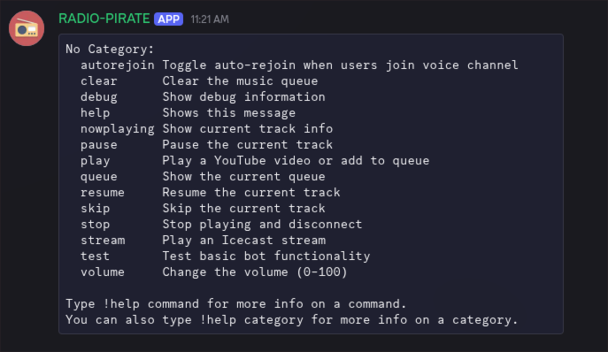

# discord-pirateFM
PirateRadio for Discord — a bot that streams radio/music/stream via Discord channels
```
🧩 Prerequisites
-Python 3.14.3
-A Discord server where you have Manage Server permissions
-A Discord Application + Bot account
-A configured .env or config file with your bot token and IDs

🛠️ Create Your Discord App
https://discord.com/developers/applications
https://docs.discord.com/developers/intro
```

